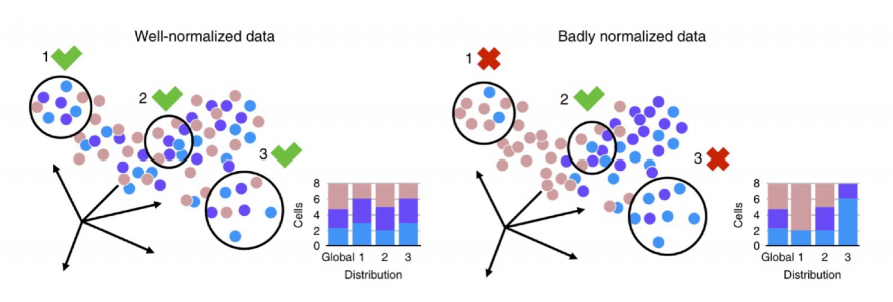

# Revisited kBET method

Various methods have been proposed in
literature to remove or reduce the cell- bias and
batch-effects in single-cell data while preserving
biological variability: linear regression such as
Combat, Seurat’s canonical correlation analysis
and projection of mutual nearest neighbors.

One of the most renowned methods that quantifies the batch effect in scRNA-seq data is kBET
method. It measures if a replicated experiment is well-mixed, i.e., it ensure that any
subset of neighboring samples has the same distribution of batch labels as the full dataset. 

# Alternative test metrics

kBET uses a \chi^2-based test for random neighborhoods of fixed size to determine whether they
are well mixed, followed by the averaging of the binary test results to return an overall rejection rate.

Here we discuss some alternative nonparametric test metrics specifically to evaluate their
performance in situations where we do not have access to a massive sized dataset: Mann Whitney U-Test, Wilcoxon T-Test, Kolmogorov–Smirnov Test.

# Data simulation

We used two different approaches for simulating scRNA-seq data and batch effects. 

* The first method samples the data points from a wero-inflated negative binomial model.
* The second approach is based on the Splat package in R using a Gamma-Poisson distribution.

#### Notes:

Folder "weak", "mild", "strong" are the simulated data.

Folder "result_dataframe" is the data of the result generated for each size ratio.

Folder "result_plot" contains the code and the results of visualization.

File "Simulations.ipynb" is a tidy and combined version of the final code.

FIle "data_sim2_generation.Rmd" is the code for data simulation.

Files named as "result_sim2_ratio_1_*_rjc.ipynb" are the raw code to run the test results for different size ratios.
